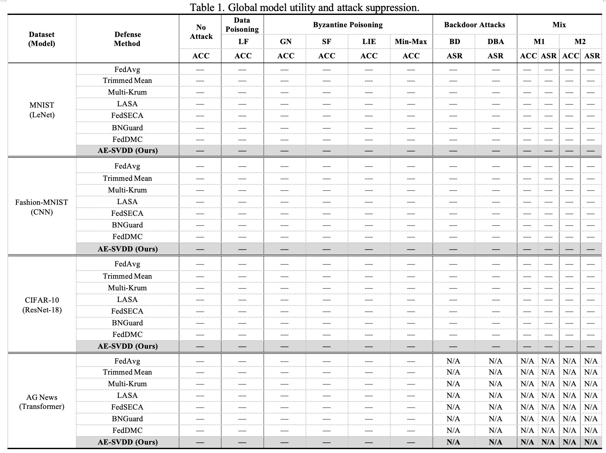
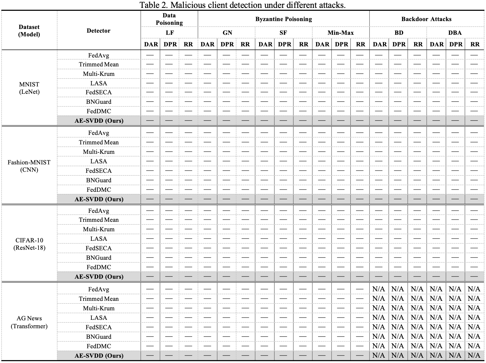
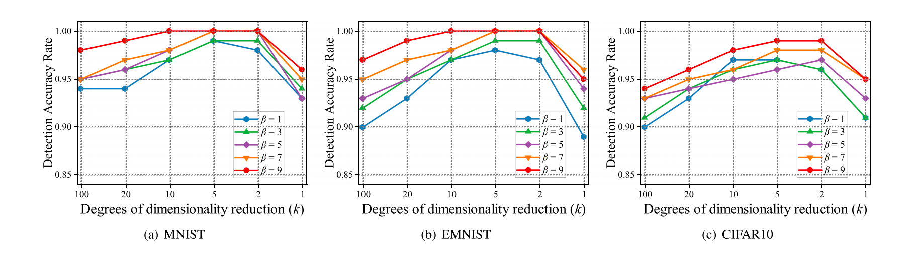
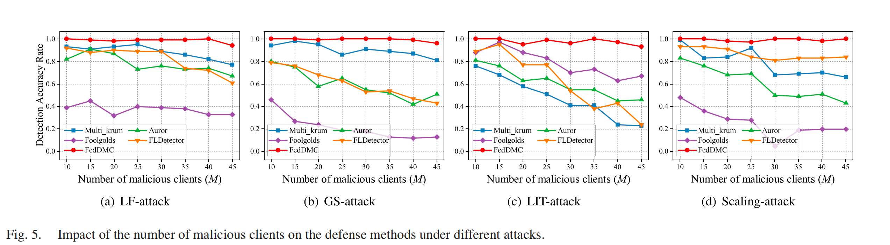
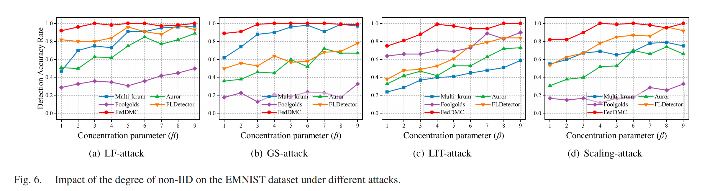
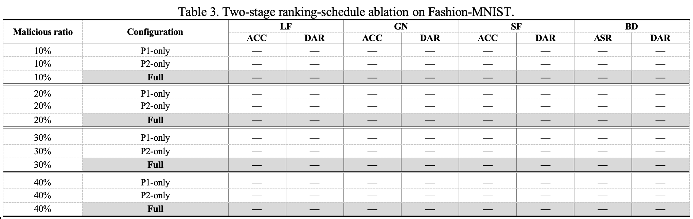
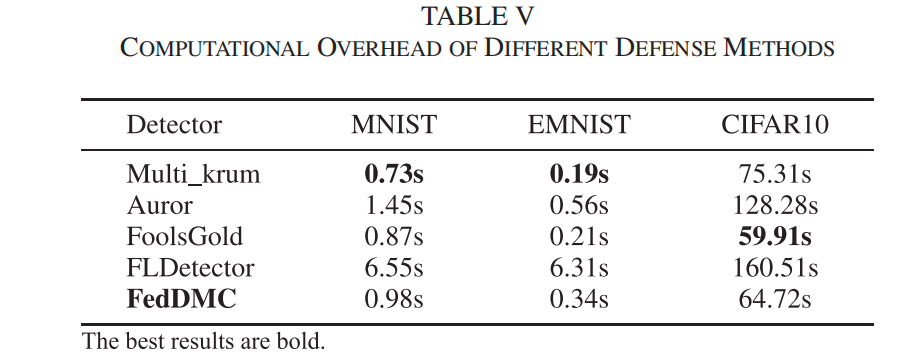

# 4. Experiments

This section evaluates the two-stage AE-SVDD defense under a fixed and reproducible federated-learning protocol. The design keeps three objects separate: the client-selection score, the AE-SVDD training objective, and the final aggregation weights. Numerical entries remain blank until they are produced by complete, parseable result files.

## 4.1 Experimental Setup

### 4.1.1 Datasets and Models

The primary study covers four image tasks and one text task. A fixed clean server-validation subset is created before client partitioning; its samples are withheld from all clients.

| Dataset                       | Input and classes             | Global model                       | Purpose                                                   |
| ----------------------------- | ----------------------------- | ---------------------------------- | --------------------------------------------------------- |
| MNIST                         | 28 x 28 grayscale, 10 classes | `LeNetClassifier`                  | Basic image-classification sanity check                   |
| Fashion-MNIST                 | 28 x 28 grayscale, 10 classes | `FashionCNN`                       | Fine-grained grayscale classification and stability check |
| CIFAR-10                      | 32 x 32 RGB, 10 classes       | CIFAR-adapted ResNet-18            | Deeper visual model and primary robustness task           |
| COVID-19 Radiography Database | Chest X-ray images, 4 classes | ImageNet-pretrained ResNet-50     | Medical-image classification and cross-domain robustness  |
| AG News                       | Tokenized text, 4 classes     | Lightweight Transformer classifier | Cross-modal transfer to text                              |

The COVID-19 task follows the commonly used four-class COVID-19 Radiography Database protocol. Images are resized to 224 x 224, replicated to three channels, and normalized with ImageNet statistics. The ImageNet-pretrained ResNet-50 feature extractor is frozen while the four-class head is trained locally. Its loader, preprocessing, client partition, and model calibration must be recorded before any result is included in the primary matrix. Accuracy is compared only within the same dataset. Cross-dataset conclusions use relative accuracy drop, detection quality, and overhead rather than raw accuracy. Image-trigger ASR is `N/A` for AG News.

### 4.1.2 Federated Learning Protocol

The following settings are shared by every defense and attack unless a subsection explicitly varies one factor.

| Setting                   | Primary value                                               |
| ------------------------- | ----------------------------------------------------------- |
| Total clients, K          | 100                                                         |
| Malicious clients         | 30 (30%; identities are used only for post-hoc scoring)     |
| Participation             | All clients participate in every round                      |
| Communication rounds      | 300 for confirmation; 100 for screening                     |
| Local epochs / batch size | 1 / 64                                                      |
| Client optimizer          | SGD, momentum 0.9                                           |
| Data partition            | Dirichlet alpha = 1.0; IID is the clean reference condition |
| Trusted validation set    | 50 clean, stratified training samples withheld from clients |

Task calibration is performed once with clean FedAvg using TACC only. The selected client optimizer settings are then shared by all defenses.

| Dataset                       |      `client_lr` | `client_weight_decay` |
| ----------------------------- | ---------------: | --------------------: |
| MNIST                         |             0.10 |                  1e-4 |
| Fashion-MNIST                 |             0.10 |                     0 |
| CIFAR-10                      |             0.05 |                  1e-4 |
| COVID-19 Radiography Database |             0.005 |              0.0005 |
| AG News                       |             0.10 |                     0 |

For the implementation preflight, a separate global smoke test covers all five
datasets (`mnist`, `fashion_mnist`, `cifar10`, `covid19`, and `ag_news`) with
5 clients, 2 malicious clients, 5 communication rounds, one local epoch, and
batch size 64. It exercises every registered defense (`avg`, `tm`, `mk`,
`lasa`, `seca`, `bnguard`, `dmc`, `svdd`, `fld`, `alignins`, `flgmm`, and
`flanders`) against `none`, `lf`, `gn`, `sf`, `bd`, `lie`, `minmax`, and
`minsum`; Mix is excluded from this preflight. The SVDD smoke override uses
Phase 1 for 3 rounds and Phase 2 for the remaining 2 rounds (`P1=3`, `P2=2`).
This is a compatibility check only and does not replace the primary 100/300-
round protocol.

### 4.1.3 Attack Settings

The attack implementations are modular client components under `src/attacks`. Values below are fixed unless an intensity experiment changes the named parameter.

| ID       | Family              | Upload or data transformation                                | Primary value                                               |
| -------- | ------------------- | ------------------------------------------------------------ | ----------------------------------------------------------- |
| None     | Control             | Ordinary local training                                      | No malicious clients                                        |
| LF       | Data poisoning      | Symmetric label map, `y' = C - 1 - y`                        | Fixed by the task label space                               |
| GN       | Byzantine poisoning | Moment-matched Gaussian replacement of floating tensors      | `gaussian_sigma = 0.3`                                      |
| SF       | Byzantine poisoning | Upload `W_g - s(W_l - W_g)`                                  | `sign_flip_scale = 1.0`                                     |
| LIE      | Byzantine poisoning | Craft delta as `mu + z sigma` from benign updates            | `lie_z_override = 0.524`                                    |
| BD       | Backdoor            | Lower-right square trigger, target label, and model replacement | target 0; poison 0.6; trigger 5; value 1.0; replacement 3.0 |
| Mix (M1) | Mixed attack        | Deterministic round-robin assignment across malicious clients | `lf, bd, gn`                                                |

Mix is simultaneous: different malicious clients apply different attacks in the same round. It is not a random choice of one attack per round. The assignment map is saved with every result file so that overall and per-family recall can be computed. Supplementary combinations are M2=`lf,sf,lie` and M3=`lf,bd,gn,lie`; they are reported only when matched runs are available. The primary AG News matrix excludes image-trigger BD and Mix.

### 4.1.4 Defense Settings

All methods receive the same client states, data partitions, round budget, and information boundary. No baseline receives malicious identities or clean validation labels unless its protocol explicitly uses the shared validation set.

| Method           | Code ID              | Core operation                                              | Parameter settings                                           |
| ---------------- | -------------------- | ----------------------------------------------------------- | ------------------------------------------------------------ |
| FedAvg           | `avg`                | Uniform aggregation of all uploads                          | No defense-specific parameter                                |
| Trimmed Mean     | `tm`                 | Coordinate-wise trimmed aggregation                         | `trimmed_mean_ratio=0.2`; `trimmed_mean_num_byzantine=null` (inferred from client composition) |
| Multi-Krum       | `mk`                 | Distance-based Byzantine selection                          | `krum_num_byzantine=null`; `multi_krum_num_selected=null` (use the implementation defaults) |
| LASA             | `lasa`               | Layer-adaptive sparsified aggregation                       | `lasa_sparsity_ratio=0.9`; `lasa_lambda_n=1.0`; `lasa_lambda_s=1.0` |
| FedSECA          | `seca`               | Sign election and coordinate aggregation                    | `fedseca_sparsity_gamma=0.9`; `fedseca_temperature=1.0`      |
| BNGuard          | `bnguard`            | Robust BN-feature distance filtering                        | `bnguard_tau=3.0`                                            |
| FedDMC-style     | `dmc`                | Magnitude, direction, sign, sparsity, and temporal views    | `dmc_warmup_rounds=3`; `dmc_tau=3.0`; weights = `(1.0, 1.0, 1.0, 0.5, 1.0)` for norm/direction/sign/sparsity/temporal |
| AE-SVDD (ours)   | `svdd`               | Fixed descriptor, AE reconstruction, and latent compactness | `latent_dim=64`; `phase1_rounds=15`; Phase 1=`recon`; Phase 2=`combined`; `λ=0.5`; descriptor dim=`4096` |
| FL-Defender      | `fld`                | PCA/reputation-based update detector                        | `fldefender_pca_components=2`; `fldefender_q1=0.25`          |
| AlignIns         | `alignins`           | Direction and principal-sign alignment                      | `alignins_sparsity=0.9`; `alignins_lambda_s=1.0`; `alignins_lambda_c=1.0` |
| FLGMM / FLANDERS | `flgmm` / `flanders` | Registered comparison implementations                       | FLGMM: `warmup_rounds=50`, `control_l=3.0`, `em_iters=50`; FLANDERS: `window=5`, `sampling=500`, `maxiter=100` |

Supplementary defenses are included only when their JSON contains the same task, seed, round budget, client population, attack, partition, and validation protocol as the comparison slice.

### 4.1.5 Evaluation Metrics

#### Global utility

- **TACC:** clean test accuracy of the final global model. In tables, `ACC` is the display label for TACC.
- **ASR:** fraction of triggered test images predicted as the target label. TACC and ASR are reported together for image backdoors and mixed image attacks.

#### Client detection

- **DAR:** the fraction of all participating clients that are correctly classified as benign or malicious.
- **DPR:** the fraction of rejected clients that are truly malicious, measuring the reliability of the rejection decision.
- **RR:** the fraction of malicious clients that are correctly rejected; this is equivalent to the malicious-client recall or true-positive rate (TPR).

# 5. Results and Analysis

This section reports the results using the same task, partition, attack, defense, and seed slices defined in Section 4. Numerical values are inserted only from complete, parseable result files. Word tables remain editable portrait tables.

## 5.1 Overall Performance

### 5.1.1 Global Model Utility

The primary matrix compares the eight primary defenses under the supported attacks. The portrait Word table groups conditions as Data Poisoning (LF), Byzantine Poisoning (GN, SF, LIE, Min-Max), Backdoor Attacks (BD, DBA), and Mix (M1, M2). `Min-Max`, `DBA`, and `M2` remain explicit columns and must be marked pending or `N/A` unless matched result files exist. `ACC` denotes TACC; `ASR` is reported for BD/DBA and the corresponding mixed conditions.

### 5.1.2 Malicious Client Detection

Detection is evaluated independently from global utility. The compact portrait Word table reports DAR / DPR / RR in every selected attack column. The complete analysis additionally retains FPR, F1, AUROC, AUPRC, accepted-client fraction, selected rejection ratio, candidate validation accuracies, losses, and mixed-attack per-family recall.

## 5.2 Parameter Sensitivity

Sensitivity experiments vary exactly one AE-SVDD factor at a time. Every run uses the single `GN` attack, the `svdd` defense, all five datasets, one seed (`42`), and 300 communication rounds. The fixed configuration is descriptor dimension 4096, `λ=0.5`, latent dimension 64, Phase-1 length 15, Phase-1 score `recon`, and Phase-2 score `combined`. The three one-factor sweeps therefore contain `(7 + 4 + 4) × 5 = 75` configurations; no Cartesian product and no additional baseline runs are included.

### 5.2.1 Loss Coefficient

Sweep the SVDD loss ratio `λ` (config key `svdd_lambda`) in `{0.2, 0.3, 0.4, 0.5, 0.6, 0.7, 0.8}`. Values 0 and 1 are not part of the main sensitivity matrix. Keep selection scores fixed (`recon` then `combined`) so only the Phase-2 training objective changes. This `λ` is distinct from the Dirichlet data-partition parameter `alpha`.

类似这张图

### 5.2.2 Phase-1 Duration

Sweep `phase1_rounds` in `{5, 15, 30, 50}` with total rounds fixed at 300. Phase 1 always uses reconstruction-error ranking, and Phase 2 always uses the combined reconstruction-error plus SVDD-distance ranking. This isolates the duration of the reconstruction warm-up while keeping `λ=0.5`.

类似这种图

### 5.2.3 Trusted Validation-Set Size

Vary the direct sample count `server_validation_size` in `{10, 25, 50, 100, 200}`. Every validation set is clean, stratified, and withheld from clients. The primary value is 50 direct samples. Keep the candidate rejection grid and tie rule unchanged so only validation reliability changes.

类似这种图

### 5.2.4 Latent Representation Dimension

Sweep `latent_dim` in `{16, 32, 64, 128}` while keeping the input descriptor dimension and all optimization settings fixed. This evaluates the compression bottleneck without changing the client-selection rule.

类似这种图

## 5.3 Robustness Analysis

Robustness factors are environment or attacker factors, not AE-SVDD training hyperparameters. Unless stated otherwise, use the 300-round primary schedule and report the final-10-round mean with three seeds.

### 5.3.1 Malicious-Client Ratio

Use malicious ratios of 10%, 20%, 30%, and 40%, with a 0% clean control. Keep `num_clients=100` and adjust `num_malicious` accordingly. A 50% boundary point may be shown separately, but it is outside the benign-majority claim.

### 5.3.2 Data Heterogeneity

Compare IID (`dirichlet_alpha=null`) with Dirichlet alpha values 1.0, 0.5, and 0.1, using 100 clients and 30% malicious clients. Report benign FPR separately from malicious RR so normal client drift is not mistaken for attack detection.

## 5.4 Ablation Study

All ablations keep the task, partition, seed, client count, attack parameters, validation size, local training budget, and candidate rejection grid fixed. Only the named component changes. Following standard component-ablation practice, `Full` is the reference configuration and each reduced configuration removes one stage. Comparisons are paired by the same dataset, malicious ratio, attack, and seed; cross-condition averages are not used to claim component complementarity.

### 5.4.1 Two-Stage Ranking Schedule

The experiment retains exactly three configurations. The names P1-only, P2-only, and Full are kept for continuity, while the parenthetical labels make the removed component explicit:

| Configuration | Standard label          | Phase-1 ranking                             | Phase-2 ranking                                             | Interpretation                         |
| ------------- | ----------------------- | ------------------------------------------- | ----------------------------------------------------------- | -------------------------------------- |
| P1-only       | without Phase 2         | Reconstruction error in all rounds          | Not entered                                                 | Reconstruction-only ranking            |
| P2-only       | without Phase 1 warm-up | Not entered                                 | Combined reconstruction error + SVDD distance in all rounds | Combined-score ranking without warm-up |
| Full          | complete model          | Reconstruction error in the first 15 rounds | Combined reconstruction error + SVDD distance thereafter    | Complete two-stage ranking             |

P1-only always uses reconstruction error. P2-only always uses the combined reconstruction-error plus SVDD-distance score. Full uses reconstruction error in Phase 1 and the combined score in Phase 2. Run the ablation only on Fashion-MNIST with malicious-client ratios of 10%, 20%, 30%, and 40%, using LF, GN, SF, and BD with seeds 42--44. LF, GN, and SF report DAR / ACC; BD reports DAR / ASR.

## 5.5 Computational Overhead

Measure overhead on the same hardware, software environment, client count, round count, and worker schedule. Exclude dataset download and repeat every measurement for all three seeds. Report median wall-clock time, sample standard deviation, peak allocated GPU memory, throughput, and result-file size where available.

For AE-SVDD, separate client local training, descriptor construction, AE/SVDD update, validation candidate evaluation, and aggregation. Evaluation of all internal candidate ratios is part of the method cost and must not be omitted.

类似这种表

All conclusions must be based on complete result files with the expected round count. Failures are summarized separately in the reproducibility appendix rather than silently removed.
